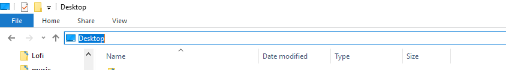

# Supertiger-Launcher
Quickly launch your games from your desktop!

# Notes

changed name in package.json from qwickGameopener to Supertiger-Launcher
so to get your settings back
first go to file browser
than go to to file area

type %appdata% then press enter
scrolldown to qwickGameopener and rename folder to Supertiger-Launcher
if settinges dont go back to normal restart program